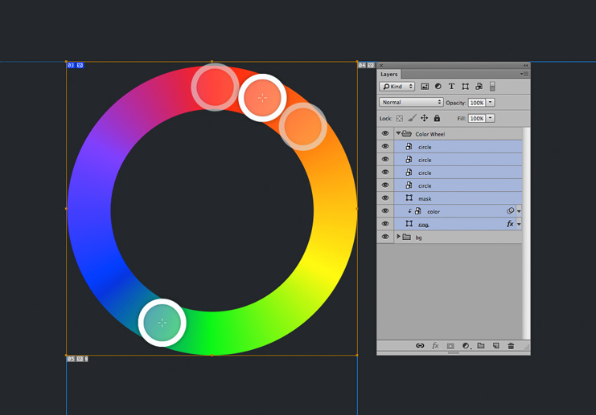
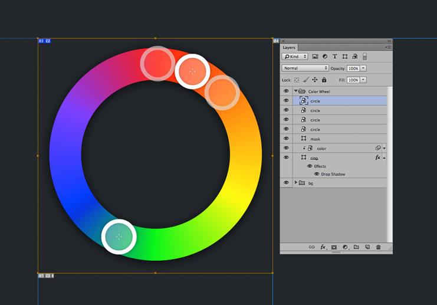

#Photoshop Make Slice From Multiple Layers

This photoshop action creates a slice from multiple selected layers. The created slice will occupy the area of all layers combined.

## Installation
Once you download and unzip the file from Github double click the **Make slice from multiple layers.atn** file and this will install it in Photoshop.

## Usage
Select all the layers from which you wish to create a slice and then run the action. You may run the action from the Photoshop Actions Panel (Window>Actions) or by using the cmd+shift+F2 shortcut.

**Please note you need to select more than one Photoshop layer or a folder for the action to work.**

## Demo

### Example 1
On the first example we have multiple layers forming one shape. The resulting slice after running the action covers all the rings.

### Example 2
On the second example we have the same shape we wish to export but we added a drop shadow to the big ring. The resulting slice now takes the shadow into account.

